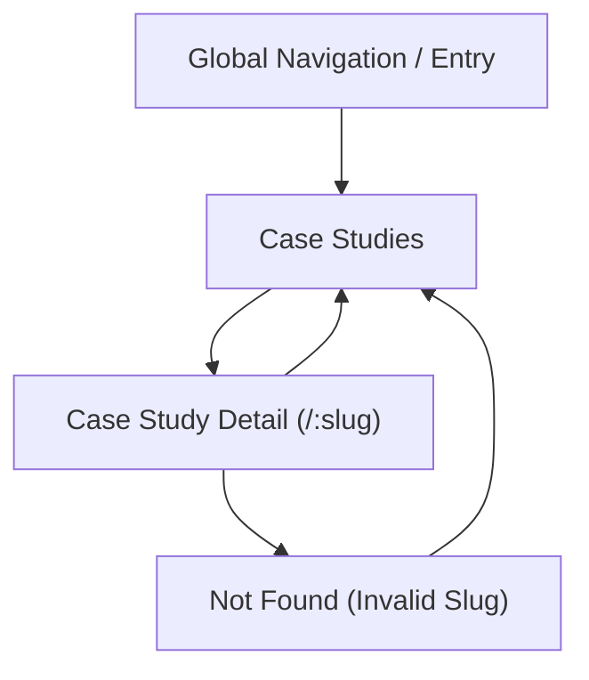

## 1. Product Overview
A Case Studies section that includes a listing page and dynamic detail pages.
Case study detail pages are generated from a single shared data file and follow the provided Figma master page UI.

## 2. Core Features

### 2.1 User Roles
No role distinction is required (public marketing content).

### 2.2 Feature Module
Our Case Studies requirements consist of the following main pages:
1. **Case Studies**: master page layout, page heading/intro, case study cards list.
2. **Case Study Detail**: master page layout, dynamic content render from one data file, in-page sections that match the Figma master page.

### 2.3 Page Details
| Page Name | Module Name | Feature description |
|-----------|-------------|---------------------|
| Case Studies | Master page shell | Render global header/navigation and global footer using the same layout as the Figma master page. |
| Case Studies | Page header/hero | Show page title and supporting intro text consistent with the Figma master page typography/spacing. |
| Case Studies | Case studies list | Render a grid/list of case study cards driven from a single local data file; each card links to its corresponding detail route. |
| Case Studies | Empty/fallback state | Show a clear empty state when the data file contains no entries. |
| Case Study Detail | Master page shell | Render global header/navigation and global footer using the same layout as the Figma master page. |
| Case Study Detail | Dynamic route resolution | Resolve a case study by a stable identifier (e.g., slug) from the single data file and render the matching entry. |
| Case Study Detail | Content sections | Render the case study sections/blocks as defined in the data file, matching the Figma master page UI hierarchy (headings, body, media blocks). |
| Case Study Detail | Not-found handling | Show a not-found state when the slug does not match any entry in the data file. |
| Case Study Detail | Back navigation | Provide a clear way to return to the Case Studies listing (e.g., breadcrumb/back link) per the master page pattern. |
| App-wide | Remove legacy single page | Remove/retire the existing single “case-study” standalone page/route so only the listing route + dynamic detail routes remain. |

## 3. Core Process
- Visitor Flow:
  1. Open the **Case Studies** page from the site navigation.
  2. Browse the case study cards in the list.
  3. Select a case study card to open a **Case Study Detail** page.
  4. Read the case study content sections and optionally navigate back to **Case Studies**.
  5. If a user visits an invalid detail URL, show a not-found state with a path back to **Case Studies**.

