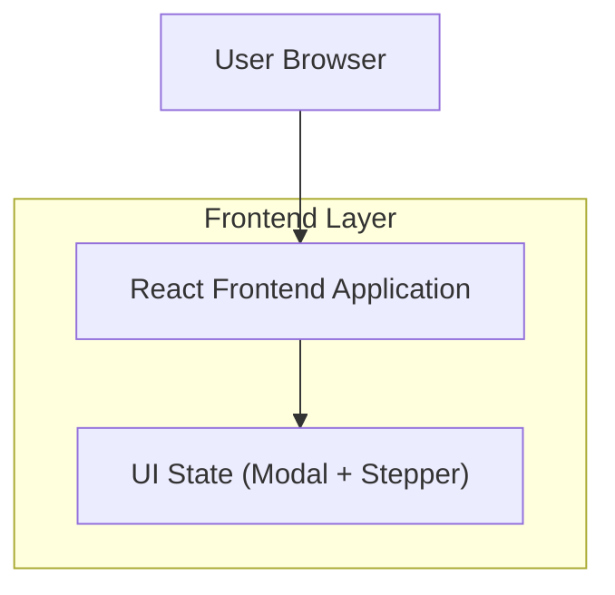

## 1.Architecture design

## 2.Technology Description
- Frontend: React@18 + TypeScript + tailwindcss@3 + (vite/next.js as per existing app)
- Backend: None (pure UI flow)

## 3.Route definitions
| Route | Purpose |
|-------|---------|
| /careers | Careers page with department modal + role-selection flow |

## 4.API definitions (If it includes backend services)
N/A (backend nahi hai).

## 6.Data model(if applicable)
N/A (server DB ki zaroorat nahi; departments/roles config se aa sakte hain).

### Implementation Tech Notes (UI)
- Modal: accessible dialog pattern (focus trap, ESC close, overlay close, aria-labelledby/aria-describedby).
- State model: `step = 'department' | 'role'`; `selectedDepartmentId`; `selectedRoleId`.
- CTA rules: 
  - Department step: `Next` disabled until department selected.
  - Role step: primary CTA disabled/hidden until role selected.
- Responsiveness: desktop-first 3 columns; smaller screens par 2 columns/1 column (CSS grid + breakpoints).
- Close behavior: close icon, overlay click (optional: only outside click), ESC; close par selection retain ya reset (project decision; default: retain until explicit reset).
- Analytics (optional): only if app already has analytics; fire events on open/close/select/CTA click.