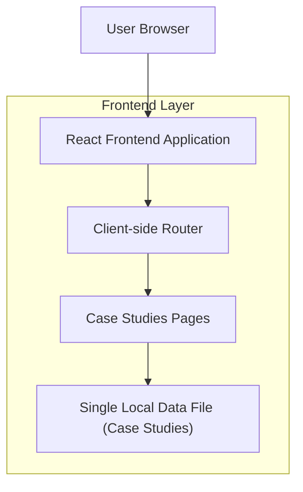
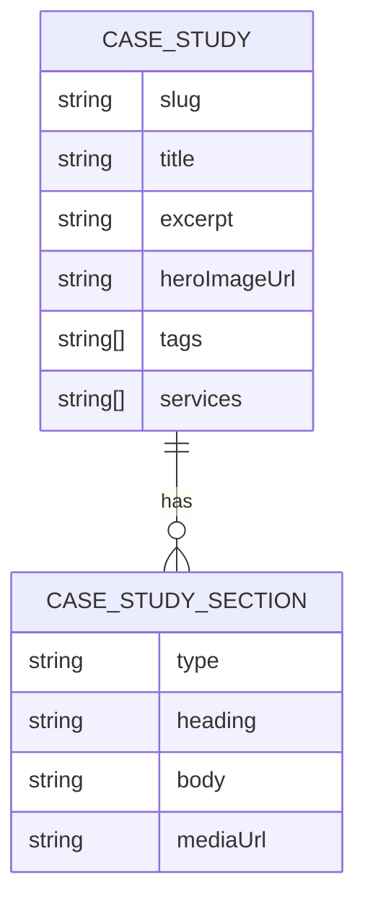

## 1.Architecture design


## 2.Technology Description
- Frontend: React@18 + react-router-dom@6 + TypeScript + tailwindcss@3 + vite
- Backend: None

## 3.Route definitions
| Route | Purpose |
|-------|---------|
| /case-studies | Case Studies listing page; renders cards from a single data file |
| /case-studies/:slug | Dynamic Case Study Detail page; resolves by slug from the same data file |

Notes:
- Remove the legacy single case study page/route (e.g., /case-study or similar) so navigation and SEO consolidate to the new listing + dynamic details.

## 6.Data model(if applicable)

### 6.1 Data model definition


### 6.2 Data Definition Language
No database is required.

Single data file (example TypeScript shape)
```ts
export type CaseStudy = {
  slug: string;
  title: string;
  excerpt: string;
  heroImageUrl?: string;
  tags?: string[];
  services?: string[];
  sections: Array<
    | { type: 'richText'; heading?: string; body: string }
    | { type: 'stats'; items: Array<{ label: string; value: string }> }
    | { type: 'media'; heading?: string; mediaUrl: string; caption?: string }
  >;
};

export const caseStudies: CaseStudy[] = [/* ... */];
```